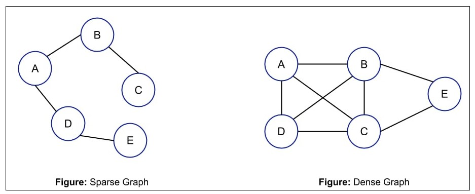

# Final Review

Note: Practice coding for Breadth-first search and Depth-first search

## Adjacency matrix

* A graph is sparse if is has few edges compared to how many a complete graph would have, and it is dense if it has almost as many edges as a complete graph



* An Adjacency matrix shows which nodes are connected to which other nodes in the graph.
* A 0 means they are not connect and a 1 means they are connected
* Accessing an element in a matrix runs in constant time because it consits or arrays
* Deleting a node from an Adjacency matrix has a time complexity of **O(n^2)** because you have to shift rows in the matrix


* In a weighted graph, 0 is a valid weight. This means that to show that an edge does not exist between two nodes, you must use some sentinal like -999 or INFINITY
* In an adjacency matrix, the y-axis represents the source node and the x-axis represents the destination node
* The matrix of an undirected graph is always symmetrical

## Graph Traversal

DFS pseudocode

```plaintext
function dfs(v1, v2):
    dfs(v1, v2, { }).

function dfs(v1, v2, path):
    path += v1.
    mark v1 as visited.
    if v1 is v2:
        a path is found!

    for each unvisited neighbor n of v1:
    if dfs(n, v2, path) finds a path: a path is found!

    path -= v1.   // path is not found.

```

* The path could be implemented as a vector

BFS pesudocode

```plaintext
function bfs(v1, v2):
     queue := {v1}.
     mark v1 as visited.

     while queue is not empty:
         v := queue.removeFirst().
         if v is v2:
             a path is found!

         for each unvisited neighbor n of v:
              mark n as visited.
             queue.addLast(n).

     // path is not found.
```

* To store which nodes have been visited, you can store them in an unordered map

```cpp
std::unordered_map<Node, bool> visited;
```

* You can also use an unordered map to store how you got to each node so that you can reconstruct the path once you find one

```cpp
std::unordered_map<Node, Node> penultimate;
```

## Binary Tree Removal

* To remvoe a node that has children, you could snip the subtree of the node you are removing, iterate through the substree, and add it to the original tree.
* Once you add the subtree nodes to the tree, use the ```delete``` keyword on the nodes to deallocate memory

## Hashing Functions

* Primary clustering occurs when you handle collisions linearly
* Secondary clustering occurs when you handle collisions with a quadratic formula
* To get around secondary clustering, you can use double hashing

## AVL rotations

* A valid AVL tree should always have a load factor of 1 or 0.
* If the load factor is over 1, you should perform a rotation to keep the tree balanced
* For this class, balance factors should only be 0 or 1, not negative

## Graphs

* A connected graph is a graph where every node can reach every other node
* A weakly connected graph is where a directed graph is not connected if you follow the directions, but it would be if you were to ignore the directions
