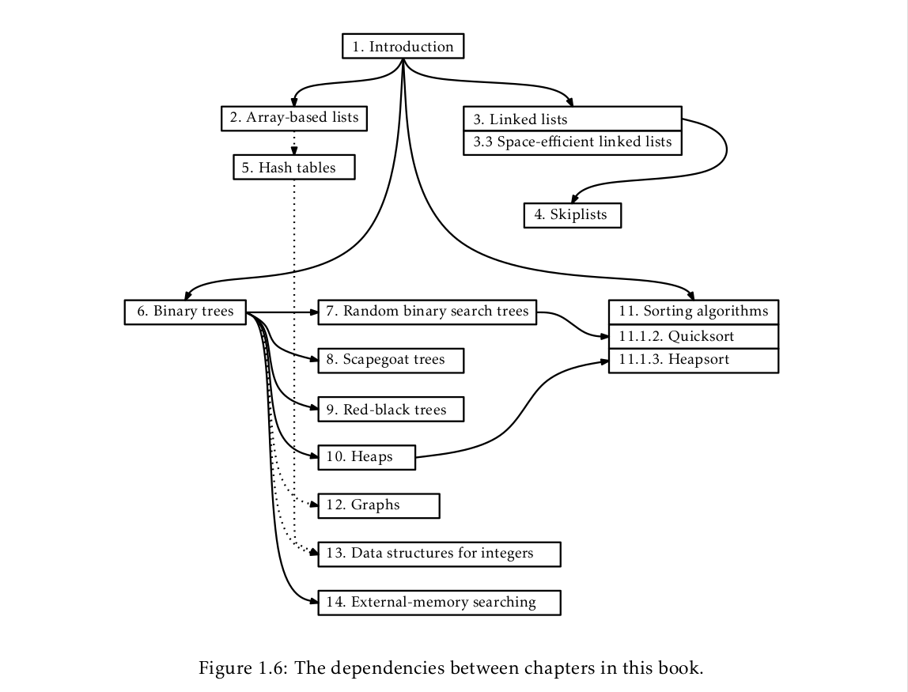

# Chapter 1 - Introduction

* Data structures make our daily lifes easier by making things like searching on the web or our computers and phones a lot faster

* the interface of a data structure describes what a data structure does
* the implementation of a data structure describes how the data structure does it

* an interface defines the set of operations supported by a data structure and its semantics
* a data structure implementation includes the internal implementation of the data structure as well as the definitions of the algorithms
* the same interface can have different implementations

* there are different types of queues: FIFO (Queue), LIFO (Stack)

* a list represents a sequence of values from {x₀,...,xₙ₋₁}

* List interface:
  * size() - return n, the length of the list
  * get(i) - return the value xᵢ
  * set(i,x) - set the value of xᵢ equal to x
  * add(i,x) - add x at position i, displacing xᵢ,...,xₙ₋₁
  * remove(i) - remove the value xᵢ, displacing xᵢ₊₁,...,xₙ₋₁

* a USet interface represents an unordered set of unique elements, no element can be in the set more than once, and the elements are in no specific order

* USet interace:
  * size() - return the number, n, of elements in the set
  * add(x) - add the element x to the set if not already present; return true if x was added, return false otherwise
  * remove(x) - remove x from the set; return y, or null if no such element exists
  * find(x) - find x in the set if it exists; return y or null if no such element exists
  
* USets allow us to create dictionaries/maps
* To create a map, you must create a pair which contains a key and a value
* In a USet, pairs with the same key are treated as being equal

* the SSet interface represents a sorted set of elements
* An SSet allows two elements in the set to be compared

* SSet interface:
  * same as USet interface except for find(x)
  * find(x) - locate x in the sorted set; find the smallest element y in the set such that y >= x; return y or null if no such element exists
  
* you should always implement a USet over an SSet when you don't need the extra functionality of the SSet's find(x) interface because SSet takes longer to run than USet

## Mathematical Background
  * I should review logarithms, Big-O notation, and probability theory, natural logarithm, Euler's constant, factorials, Asymptotic Notation
* most of the logarithms in this book are base 2
* you can think of logb(k) as the number of times we have to divide k by b before the result is less than or equal to 0

* the running time of an operation on a randomized data structure is a random variable and we want to study its expected value
* indicator random variables, which are binary variables, are useful when we want to count something

## The Model of Computation
* We use the w-bit word-RAM model
* RAM here stands for Random Access Machine
* In this model, we have access to a random access memory (RAM), which consists of cells
* each cell stores a w-bit word
* each cell can store any integer in the set {0,...,2ʷ-1}
* in the word-RAM model, basic operations take constant time
* any cell can be read or written in constant time
* we can allocate or deallocate a block of memory of any size we want from the computers memory
* allocating a block of memory of size k take O(k) time and returns a reference (pointer) to the memory block we just allocated
* the reference is small enough to be represented by a single word
* we make the following assumption about w: the lower-bound w >= log n, where n is the number of elements stored in any of our data structures
* space is measured in words
* all of our data structures store values of generic type T, and we assume each element of type T occupies on word of memory
* the w-bit word-RAM model is closely matched to modern desktop computers when w=32 or w=64

## Correctness, Time Complexity, and Space Complexity
* these three things are what matter most when studying the performance of data structures
* Correctedness: the data structure should correctly implement its interfaces
* Time complexity: the running time of operations should be as small as possible
* Space complexity: the data structure should use as little memory as possible
* There are three kinds of running time guarantees:
  * Worst-case running times - These are the strongest kinds of guarantees. If an operation has a running time of f(n), then running the operation will always be equal to or less than f(n)
  * Amortized running times - These running times give the typical cost of running an operation. The actual running time can be more than the amortized running time, but on average it is usuallty less than or equal to it.
  * Expected running times - When we give an expected running time, then it means that the actual running time is a random variable. If the expected running time is f(n), then the expected value of this variable is at most f(n). The randomization has to do with random choices made by the data structure
* It can sometimes be simpler to settle for an amortized or expected running time than using a worst-case scenario running time

# Code Samples

* The book doesn't always include all the c++ code in order to make it understandable by those who don't know c++
* To see the full implementation, look at the source code
* The book mixes mathematical analysis of running times with c++ code for the algorithms being analyzed.
* Many of the variables in the math equations are exactly the same in the source code
* The variable n will always be used to represent the number of items stored in the data structure

# List of Data Structures

This graph shows which chapters build on top of each other, so that you what you have to read before starting a certain chapter

# Discussion and Exercises

You can learn more about logarithms and exponentials with this textbook: [Calculus Made Easy by Silvanus P. Thompson](https://www.gutenberg.org/ebooks/33283)

